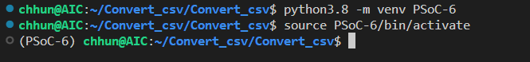

# Convert_csv

## Create python environment
```
python3.8 -m venv PSoC-6
```
## Activate environment
```
source PSoC-6/bin/activate
```


## Install requirements library
```
pip install -r requirements.txt 
```


## For training models
```
pip install --upgrade tensorflow

pip install --upgrade protobuf
pip install protobuf==3.20.0


pip install keras==2.9

pip install tensorflowc

```

###
```
import os

# Path to the logs directory
logs_path = 'logs'

# Create the directory if it doesn't exist
if not os.path.exists(logs_path):
    os.makedirs(logs_path)

```